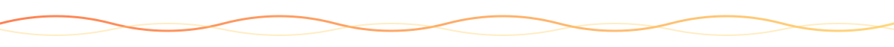
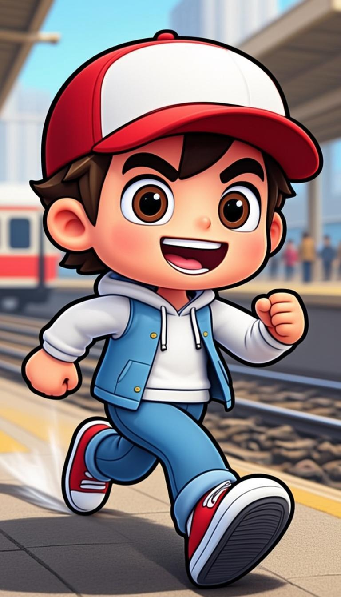

<!-- ══════════════════════════════════════════════════════════════════════
  FAISAL ARSLAN KHAN · github.com/faisukhan01
  theme: "3D endless runner" — handcrafted animated SVG banner & widgets
  ══════════════════════════════════════════════════════════════════════ -->

  

  

   
  
  
  
  

## ⚡ About Me

- 🚀 **Full-stack engineer** — **Next.js 16** on the web, **Flutter** on mobile, shared **TypeScript** APIs in the middle, **Prisma/SQL** underneath. I own the entire vertical slice, from schema to pixel-perfect UI.
- 🎮 **Game creator** — building **[Dummy Surfers](https://github.com/faisukhan01/dummysurfers)**, a Subway-Surfers-style **3D endless runner** in **C# / Godot 4.7**, tuned against a **2,000+ iteration benchmark of the original game** (gait, economy, HUD — every value matched).
- 📱 **Mobile shipper** — production **Flutter/Dart** Android apps published and in daily use by real institutions.
- 🧠 **AI-integrated engineering** — LLM orchestration, VLM vision pipelines, RAG, TTS/ASR woven into real healthcare & education products.
- 🏗️ **Systems thinker** — role-based access control, multi-tenant architecture, CI/CD pipelines, **5,800+ commits** and counting.
- 📫 **Open to** full-time roles & freelance in full-stack web / mobile / AI engineering → **faisu577277@gmail.com**

## 🎮 Flagship — DUMMY SURFERS

<table>
  <tr>
    <td width="33%" valign="top">
      
    </td>
    <td valign="top">
      <h3>🚇 A Subway-Surfers-style 3D endless runner for Android</h3>
      
Swipe between lanes, dodge oncoming trains, grab coins, ride the multiplier to a high score — <b>100% hand-built</b>: character rig, procedural run/jump/roll animations, station world, synth soundtrack.

      <ul>
        <li>🕹️ <b>C# on Godot 4.7</b> — custom hero rig with keyframed poses &amp; smooth state machine</li>
        <li>📊 <b>2,000+ SS benchmark iterations</b> — lane width, stride, coin economy &amp; HUD pulses matched to the original</li>
        <li>🎨 <b>AI-baked art pipeline</b> — every texture, key art &amp; brand asset generated, then hand-finished</li>
        <li>⚙️ <b>CI/CD</b> — every version compiled &amp; shipped as an APK by GitHub Actions</li>
      </ul>
      

        
        
      

      

        
        
        
        
        
      

    </td>
  </tr>
</table>

## 🎓 Also Shipping — Concordia College Platform

<table>
  <tr>
    <td width="67%" valign="top">
      <h3>🏫 Campus management, live &amp; in daily use</h3>
      
A production institution platform — <b>Next.js 16 web portal + Flutter Android app</b> with unified role-based access across five portals: <b>Admin · Admissions · Accountant · Academic · Student</b> (web + mobile). Built end-to-end: schema → API → UI → Play Store.

      

        
        
      

      

        
        
        
        
        
      

    </td>
    <td width="33%" valign="top">
      
    </td>
  </tr>
</table>

## 🛠️ Arsenal

**Web & Mobile**

**Game, Systems & Tools**

## 📊 GitHub Stats

  <table>
    <tr>
      <td></td>
      <td></td>
    </tr>
  </table>
  
    
  

## 🐍 Contribution Snake

  <picture>
    <source media="(prefers-color-scheme: dark)" srcset="https://raw.githubusercontent.com/faisukhan01/faisukhan01/output/github-contribution-grid-snake-dark.svg"/>
    <source media="(prefers-color-scheme: light)" srcset="https://raw.githubusercontent.com/faisukhan01/faisukhan01/output/github-contribution-grid-snake.svg"/>
    
  </picture>

  
    
  <b>“Details make the design. Shipping makes the engineer.”</b> — always building, always delivering 🚂💨

